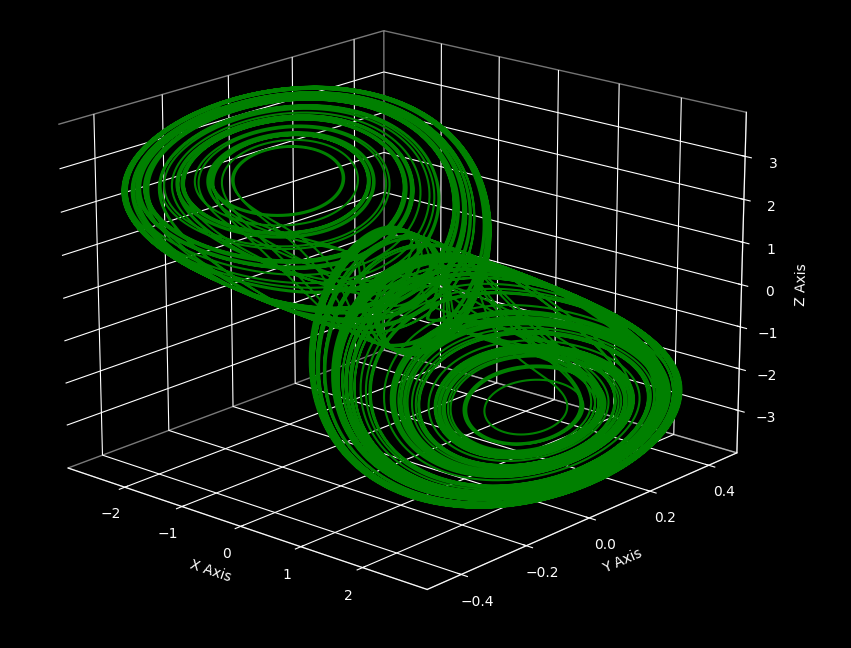
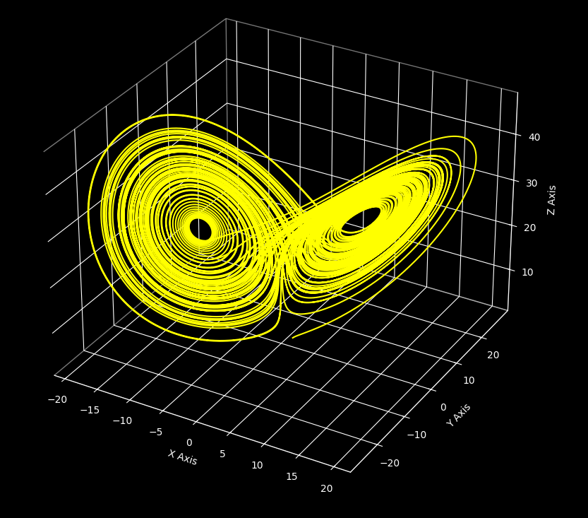
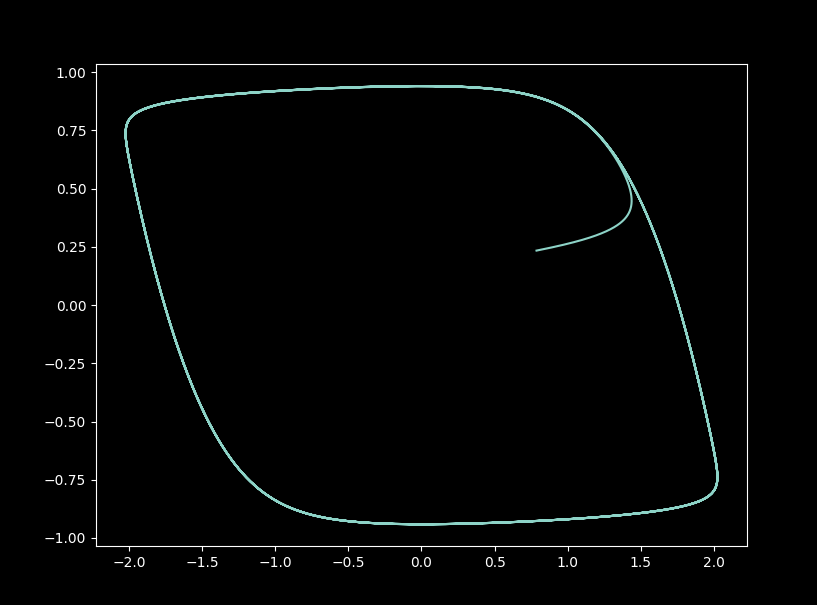

# Control-Systems-Algorithms

Control Systems Library to quickly simulate and visualize complex systems behavior.

### Chua Circuit

### Lorenz Attractor

### Damped Pendulum

### Van Der Pol Oscillator

